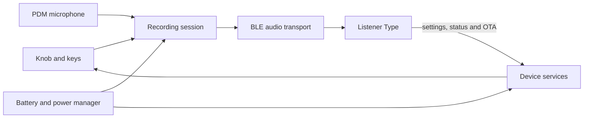

# Listener Firmware

<p align="center">
  <strong>Production firmware for the Listener voice keyboard</strong><br />
  ESP32-S3 · ESP-IDF 5.5 · BLE audio and HID · dual-slot OTA
</p>

<p align="center">
  <a href="https://github.com/Listener-ai-Macau/Listener-Firmware/releases"></a>
  
  
</p>

Firmware for the Listener voice keyboard: an ESP32-S3 desktop controller that captures speech, streams it to Listener Type over Bluetooth, and puts recording controls and product status under your hand.

[简体中文](README.zh.md) · [繁體中文](README.zh-TW.md) · [Firmware releases](https://github.com/Listener-ai-Macau/Listener-Firmware/releases) · [Listener Type](https://github.com/Listener-ai-Macau/Listener-Type)

<p align="center">
  
</p>

## One Listener product

| Repository | Responsibility |
| --- | --- |
| [Listener Type](https://github.com/Listener-ai-Macau/Listener-Type) | Speech recognition, text cleanup and styles, translation, history, cursor insertion, settings UI, and desktop updates |
| Listener Firmware | Microphone capture, BLE audio/HID, physical controls, LEDs, battery and power behavior, device settings, diagnostics, and firmware OTA |

The firmware does not turn speech into text on its own. Listener Type receives the audio, produces the final text, and inserts it into the focused app.



## Hardware at a glance

| Part | Current V2 profile |
| --- | --- |
| Controller | ESP32-S3-WROOM-1-N16R8, 16 MB flash, 8 MB Octal PSRAM |
| Audio | PDM microphone, 16 kHz capture, framed BLE streaming with retained/replayable packets |
| Controls | Clickable and rotary EC11 knob plus KEY1–KEY4 |
| Feedback | Six status zones: PWR, BLE, REC, AI, OK, WARN |
| Wireless | BLE audio services, BLE HID keyboard, settings, diagnostics, battery service, and OTA |
| Power | Li-ion battery, USB-C charging, battery measurement, low-power idle, wake on controls, and timed shutdown |

## What the firmware does

| Area | Capabilities |
| --- | --- |
| Voice capture | Starts/stops device recording, captures PDM audio, frames and queues PCM, preserves trailing audio, and reports transport state |
| BLE audio | Subscribable audio stream, paced notification transport, retry/backpressure handling, retained packet replay, and session identity |
| Keyboard controls | EC11 click/double-click/long-press/rotation; KEY1–KEY4 single-, double-, and long-press events; safe BLE HID fallbacks |
| Product feedback | Recording, transfer, processing, success, warning, pairing, charging, battery, and low-power LED states |
| Device settings | Persistent BLE name, LED brightness by zone, knob rotation action, plugged/battery idle timers, low-power policy, and shutdown timers |
| Battery and power | Standard BLE battery reporting, charging/full state, low-battery protection, idle microphone suspension, wakeable controls, and hardware shutdown |
| Pairing and recovery | Discoverable pairing, bond reset, reconnect behavior, serial maintenance, and explicit factory reset paths |
| OTA | Dual application slots, package validation, progress reporting, pending verification, rollback, and normal preservation of pairing/settings |
| Diagnostics | Flash-backed event log, health heartbeat, BLE/serial export, source filters, bounded reports, and machine-readable diagnostic bundles |
| Engineering tools | Reproducible setup/build/flash/monitor commands plus static and hardware validation for board, audio, BLE, power, keys, and OTA |

## From power-on to text

1. Charge the keyboard and click the knob to power on.
2. In Listener Type, choose Settings → Device → Start pairing. Select `listener` in Windows Bluetooth, then check the connection in Type.
3. Focus a text field, click the knob, speak, then click again.
4. REC shows capture; AI shows transfer or processing; OK confirms completion. Listener Type puts the result at the cursor.

Voice-triggered recording is configured in Listener Type. The firmware keeps a low-power voice activity path ready and transports the candidate audio; the desktop app validates the wake phrase and optional voiceprint before accepting a dictation session.

## Controls and lights

| Control | Default product behavior |
| --- | --- |
| Knob click | Start or stop dictation |
| Knob double-click | Clear the Bluetooth bond and become discoverable |
| Knob long-press | Power off |
| Knob rotation | System volume; configurable to screen brightness or disabled |
| KEY1–KEY4 | Configurable single/double/long actions in Listener Type |

| Light | Meaning |
| --- | --- |
| PWR | Power, charging, and battery class |
| BLE | Pairing, reconnecting, connected, and Type-ready state |
| REC | The device is capturing audio |
| AI | Audio transfer or desktop processing |
| OK | Success or OTA progress |
| WARN | A recoverable error needs attention |

All lights off usually means low-power idle. Brightness and idle/shutdown timers are configurable from Listener Type. Windows can read the current level through the standard Bluetooth Battery Service.

<p align="center">
  
</p>

## Update and recovery

Normal users update from Listener Type with a release OTA ZIP. OTA uses two firmware slots and can roll back an unverified image; normal updates preserve Bluetooth bonds and device settings. Double-click the knob for pairing recovery. USB flashing and full erase are engineering/recovery operations and can reset stored state.

The latest tagged firmware is on [Releases](https://github.com/Listener-ai-Macau/Listener-Firmware/releases). Match it with the same Listener Type release where possible, and verify the SHA-256 published on the release page.

## Product status

| Status | Capability | Current scope |
| --- | --- | --- |
| **Stable** | Manual dictation transport | Knob-controlled PDM capture, BLE streaming, tail preservation, and desktop completion feedback |
| **Stable** | Controls and product feedback | EC11, KEY1–KEY4, BLE HID fallbacks, LEDs, battery, persistent settings, and low-power behavior |
| **Stable** | Update and recovery | Type-driven OTA, package checks, dual slots, pending verification, rollback, pairing reset, and USB recovery |
| **Limited** | Voice-triggered sessions | Firmware transports candidate audio; wake phrase, voiceprint, session ending, and speaker ownership are decided by Listener Type |
| **Engineering** | Factory and diagnostics | Serial commands, flash-backed logs, diagnostic bundles, replay, full erase, and wired flashing require trained handling |

These labels describe the current product contract. Low-level commands and validation entry points are catalogued in the [firmware feature map](docs/features/firmware-feature-map.md).

## Release history

| Release | Firmware milestone |
| --- | --- |
| 1.0.1 | Established the Listener firmware release package |
| 1.0.3 | Accepted BLE transfer throughput, OTA/boot behavior, and status-light contracts |
| 1.0.4 | Consolidated recording, wake, automatic ending, pairing recovery, power, and product-light behavior |
| 1.0.5 | Matched the current voice keyboard controls and feedback with the Type 1.0.5 daily-use path |

Exact OTA packages and checksums are kept on the [GitHub Releases page](https://github.com/Listener-ai-Macau/Listener-Firmware/releases).

## Build and flash

Windows scripts prepare ESP-IDF `release/v5.5` and keep the environment consistent:

```powershell
pwsh -NoProfile -File .\tools\setup_windows.ps1
pwsh -NoProfile -File .\tools\build.ps1
pwsh -NoProfile -File .\tools\flash.ps1 -Port COMx
pwsh -NoProfile -File .\tools\monitor.ps1 -Port COMx
```

Use `tools\idf.ps1` for ad hoc ESP-IDF commands instead of running bare `idf.py`.

## Repository map

- `components/` — portable product logic for controls, power, settings, health, OTA, and diagnostics
- `ports/esp32/` — ESP-IDF bindings for board, audio, BLE, storage, and hardware services
- `protocols/` — shared device protocol definitions and codecs
- `main/` — startup and subsystem wiring
- `tools/` — setup, build, flash, monitor, packaging, diagnostics, and validation
- `docs/features/firmware-feature-map.md` — full implementation and validation map

Read [CONTRIBUTING.md](CONTRIBUTING.md) before contributing, [SUPPORT.md](SUPPORT.md) for useful bug reports, and [SECURITY.md](SECURITY.md) for security reports. This repository currently has no `LICENSE` file, so source availability alone does not grant redistribution or modification rights.
