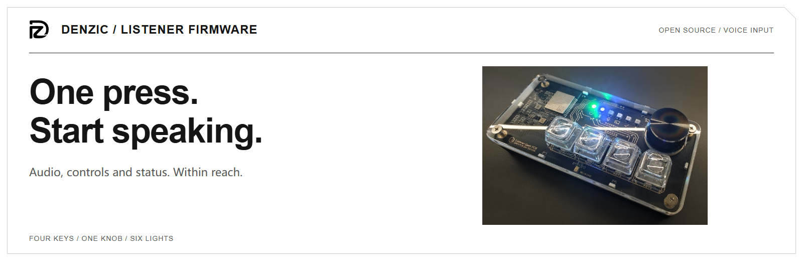
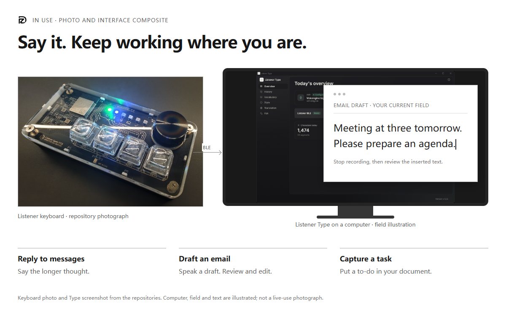

<picture>
  <source media="(prefers-color-scheme: dark) and (max-width: 600px)" srcset="docs/assets/listener/firmware-hero-en-mobile-dark.png">
  <source media="(prefers-color-scheme: dark)" srcset="docs/assets/listener/firmware-hero-en-dark.png">
  <source media="(max-width: 600px)" srcset="docs/assets/listener/firmware-hero-en-mobile.png">
  
</picture>

**English** · [简体中文](README.zh-CN.md)

# Listener Firmware

**Put audio capture, recording controls and visible status within reach.**

**[Try with a computer microphone first](https://github.com/Listener-ai-Macau/Listener-Type/releases)** · [Have a keyboard? Connect it](#from-power-on-to-the-first-sentence) · [Firmware downloads](https://github.com/Listener-ai-Macau/Listener-Firmware/releases) · [Foldout manual](https://github.com/Listener-ai-Macau/Listener-Type/blob/master/docs/manuals/Listener-fold-EN.pdf)

> **Hardware presale phase · Purchase link not yet announced**
> Try the app with your computer microphone. If you already have a keyboard, follow the connection steps below.

| Within reach | How it works |
| --- | --- |
| Press to start, press to stop | The knob controls recording; the computer transcribes and inserts. |
| See the current state | Six lights distinguish recording, processing, completion and connection issues. |
| Physical keys for everyday actions | Customize four keys; rotate the knob for volume by default. |

## At your desk, with the app you are using

<picture>
  <source media="(prefers-color-scheme: dark) and (max-width: 600px)" srcset="docs/assets/listener/usage-scene-en-mobile-dark.png">
  <source media="(prefers-color-scheme: dark)" srcset="docs/assets/listener/usage-scene-en-dark.png">
  <source media="(max-width: 600px)" srcset="docs/assets/listener/usage-scene-en-mobile.png">
  
</picture>

The keyboard captures audio and provides controls; Type on the computer handles text. This composite uses repository photos and a screenshot; the input field is illustrated.

## From power-on to the first sentence

1. Install and open [Listener Type](https://github.com/Listener-ai-Macau/Listener-Type/releases). Configure recognition-provider credentials or prepare a local model.
2. Charge over USB-C and click the knob to power on.
3. Start pairing in Type → Settings → Device. Select `listener` in Windows Bluetooth and check the connection in Type.
4. Select Listener BLE input, focus a field and click the knob. Speak, then click again to stop.

Bluetooth “paired” alone does not mean Type is ready. Windows is the primary full hardware-audio path.

The companion Type app is free and open source; cloud recognition and text services bill separately. Without an API key, try a Windows local model with Raw. See [app setup and costs](https://github.com/Listener-ai-Macau/Listener-Type#free-app-separate-service-costs).

<picture>
  <source media="(prefers-color-scheme: dark)" srcset="docs/assets/listener/keyboard-lineart-dark.png">
  
</picture>

## A state you can see

| Light | Color and rhythm |
| --- | --- |
| PWR | Green / amber / red battery; red double-blink at critical level. White breathing charges; solid white is full |
| BLE | Blue pulses: pairing/reconnect. Dim blue double: Type not ready. Solid blue: ready |
| REC | Gold follows audio while recording |
| AI | Purple rhythm during transfer or processing |
| OK | Brief green on completion; cyan-green progress during OTA |
| WARN | Amber or red: check the app's error message |

[Full light language](docs/features/status_led.md). Read labels and rhythms as well as colors.

## Defaults you can make your own

| Control | Default |
| --- | --- |
| Knob click / rotation | Toggle dictation / system volume |
| Knob double-click / hold | Reset pairing / hold until shutdown confirms |
| KEY1 / KEY2 / KEY3 / KEY4 | Right Ctrl / Ctrl+C / Ctrl+V / Ctrl+Z |

Key double-click and long-press actions default to disabled. Assign dictation, templates, shortcuts and other actions in Type's Device page. Status, key, knob and edge brightness are independently adjustable.

Wake phrase and voiceprint are configured on the same page. Without enrollment, anyone saying the phrase may trigger recording. Deleting a voiceprint does not disable wake. With wake enabled, REC off does not mean the microphone is fully off.

## Rest when idle, wake when needed

Battery defaults: low power after about one idle minute, shutdown after ten. USB defaults: low power after three minutes, no automatic shutdown. Low-power mode retains power feedback and wakes on a key or knob action. Use the knob after actual shutdown. Timers and brightness are configurable.

## Update and recover

Use a matching release OTA ZIP in Type's Device page. Keep power and connection stable; verify the version after reboot. Normal OTA preserves pairing and settings. Knob pairing reset is different from engineering full erase.

## Development

This is the open-source firmware repository for the Listener voice keyboard. The keyboard sends audio over Bluetooth to Listener Type; the computer handles recognition and text insertion. The companion app is required.

| Directory | Contents |
| --- | --- |
| `components/` | Controls, lights, power, settings, OTA and diagnostics |
| `ports/esp32/` | Audio, BLE, storage and board bindings |
| `protocols/` | Device protocols and codecs |
| `tools/` | Build, flash, monitor, package and validation scripts |

```powershell
pwsh -NoProfile -File .\tools\setup_windows.ps1
pwsh -NoProfile -File .\tools\build.ps1
pwsh -NoProfile -File .\tools\flash.ps1 -Port COMx
pwsh -NoProfile -File .\tools\monitor.ps1 -Port COMx
```

Use `tools/idf.ps1` for ad hoc ESP-IDF commands. Continue with [Contributing](CONTRIBUTING.md) and the [feature map](docs/features/firmware-feature-map.md).

[Security](SECURITY.md)

[Apache-2.0](https://github.com/Listener-ai-Macau/Listener-Firmware/blob/master/LICENSE)
