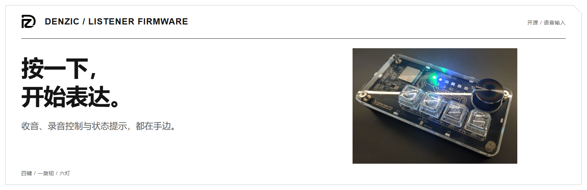
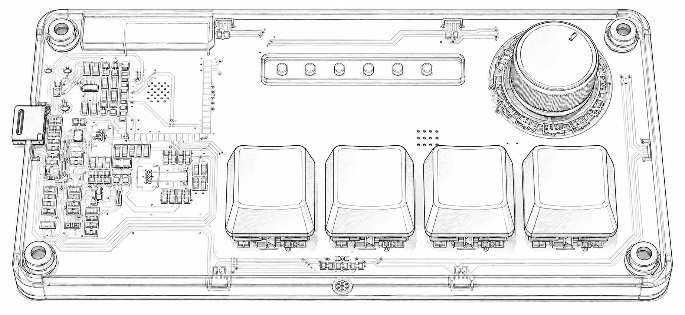

<picture>
  <source media="(prefers-color-scheme: dark) and (max-width: 600px)" srcset="docs/assets/listener/firmware-hero-mobile-dark.png">
  <source media="(prefers-color-scheme: dark)" srcset="docs/assets/listener/firmware-hero-dark.png">
  <source media="(max-width: 600px)" srcset="docs/assets/listener/firmware-hero-mobile.png">
  
</picture>

**简体中文** · [English](README.md)

# Listener Firmware

**把收音、录音控制和状态提示放到手边。**

**[先用电脑麦克风体验](https://github.com/Listener-ai-Macau/Listener-Type/releases)** · [已有键盘：开始连接](#从开机到第一句话) · [固件下载](https://github.com/Listener-ai-Macau/Listener-Firmware/releases) · [折页说明书](https://github.com/Listener-ai-Macau/Listener-Type/blob/master/docs/manuals/Listener-fold-ZH.pdf)

> **硬件预售阶段 · 购买入口尚未公布**
> 可以先用电脑麦克风体验软件。已有键盘的用户按下方步骤连接。

| 放到手边的体验 | 怎样使用 |
| --- | --- |
| 一按就开始，再按就结束 | 旋钮默认控制录音，电脑完成识别和写入。 |
| 抬眼知道进行到哪 | 六颗状态灯区分录音、处理、完成和连接问题。 |
| 常用动作有实体按键 | 四键支持自定义；旋转旋钮默认调节音量。 |

## 放在桌上，配合正在用的电脑

<picture>
  <source media="(prefers-color-scheme: dark) and (max-width: 600px)" srcset="docs/assets/listener/usage-scene-zh-mobile-dark.png">
  <source media="(prefers-color-scheme: dark)" srcset="docs/assets/listener/usage-scene-zh-dark.png">
  <source media="(max-width: 600px)" srcset="docs/assets/listener/usage-scene-zh-mobile.png">
  
</picture>

键盘负责收音与按键控制，电脑上的 Type 处理文字。图片使用仓库实物照片和软件截图组合；输入框为示意。

## 从开机到第一句话

配套 Type 软件免费开源；云端识别或文字服务按提供方计费。没有 API Key，可先用 Windows 本地模型与 Raw 试录；详见[软件配置说明](https://github.com/Listener-ai-Macau/Listener-Type/blob/master/README.zh-CN.md#软件免费服务费用分别计算)。

1. 先安装并打开 [Listener Type](https://github.com/Listener-ai-Macau/Listener-Type/releases)，配置识别服务凭据或准备本地模型。
2. USB-C 充电，单击旋钮开机。
3. Type「设置 → 设备」开始配对，在 Windows 蓝牙选择 `listener`，返回软件检查连接。
4. 输入来源选 Listener BLE，放好光标；旋钮单击开始，说完再单击停止。

蓝牙“已配对”不等于 Type 已就绪。硬件完整音频路径当前以 Windows 为主。

<picture>
  <source media="(prefers-color-scheme: dark)" srcset="docs/assets/listener/keyboard-lineart-dark.png">
  
</picture>

## 读懂状态，操作就有把握

| 灯 | 颜色与节奏 |
| --- | --- |
| PWR | 电池绿 / 琥珀 / 红；极低电量红双闪。白色呼吸充电，常亮充满 |
| BLE | 蓝色脉冲：配对 / 重连；暗蓝双闪：Type 未就绪；蓝常亮：就绪 |
| REC | 金色随声音变化：录音 |
| AI | 紫色节拍：传输或处理 |
| OK | 绿色短亮：完成；OTA 显示青绿色进度 |
| WARN | 琥珀或红色：关注软件错误提示 |

[完整灯语](docs/features/status_led.md) · 不只看颜色，也看灯名与节奏。

## 默认动作与个人设置

| 控件 | 默认动作 |
| --- | --- |
| 旋钮单击 / 旋转 | 开始或停止录音 / 系统音量 |
| 旋钮双击 / 持续长按 | 重置蓝牙配对 / 等待确认完成后关机 |
| KEY1 / KEY2 / KEY3 / KEY4 | 右 Ctrl / Ctrl+C / Ctrl+V / Ctrl+Z |

四键的双击和长按默认禁用；可在 Type 设备页映射听写、模板、快捷键与其他动作。状态区、按键、旋钮和板边亮度可分别调节。

同页可配置唤醒词与声纹。未录制声纹时，任何人说对唤醒词都可能触发；删除声纹不会关闭唤醒。启用唤醒时，REC 熄灭不代表麦克风完全关闭。

## 空闲时省电，需要时唤醒

电池默认空闲约 1 分钟低功耗、10 分钟关机；USB 默认约 3 分钟低功耗，不自动关机。低功耗保留电源提示，按键或旋钮可唤醒；真正关机后用旋钮开机。计时与亮度可调整。

## 更新与恢复

普通用户从 Releases 获取匹配的 OTA ZIP，在 Type 的设备页更新。保持供电与连接，完成重启后核对版本。正常 OTA 保留配对与设置；双击旋钮重配与工程全擦写是不同操作。

## 开发入口

这是 Listener 语音键盘的开源固件仓库。键盘通过蓝牙把声音交给 Listener Type，由电脑完成识别与文字输入；它需要配套软件。

| 目录 | 内容 |
| --- | --- |
| `components/` | 控制、灯光、电源、设置、OTA 与诊断逻辑 |
| `ports/esp32/` | 音频、BLE、存储与硬件适配 |
| `protocols/` | 设备协议与编解码 |
| `tools/` | 构建、刷写、监控、打包与验证 |

```powershell
pwsh -NoProfile -File .\tools\setup_windows.ps1
pwsh -NoProfile -File .\tools\build.ps1
pwsh -NoProfile -File .\tools\flash.ps1 -Port COMx
pwsh -NoProfile -File .\tools\monitor.ps1 -Port COMx
```

临时 ESP-IDF 命令使用 `tools/idf.ps1`。从[贡献指南](CONTRIBUTING.md)与[功能映射](docs/features/firmware-feature-map.md)继续。

[安全](SECURITY.md)

[Apache-2.0](https://github.com/Listener-ai-Macau/Listener-Firmware/blob/master/LICENSE)
