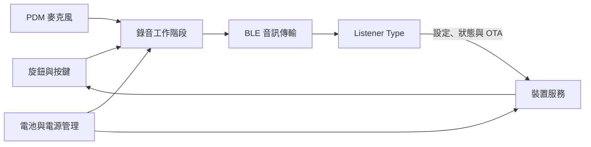

# Listener Firmware

<p align="center">
  <strong>Listener 語音鍵盤的產品韌體</strong><br />
  ESP32-S3 · ESP-IDF 5.5 · BLE 音訊與 HID · 雙分割區 OTA
</p>

<p align="center">
  <a href="https://github.com/Listener-ai-Macau/Listener-Firmware/releases"></a>
  
  
</p>

Listener 語音鍵盤的韌體。它執行在 ESP32-S3 桌面裝置上，採集語音並透過藍牙送給 Listener Type，把錄音控制和產品狀態放在手邊。

[English](README.md) · [简体中文](README.zh.md) · [韌體發布](https://github.com/Listener-ai-Macau/Listener-Firmware/releases) · [Listener Type](https://github.com/Listener-ai-Macau/Listener-Type)

<p align="center">
  
</p>

## 一個完整的 Listener 產品

| 倉庫 | 負責什麼 |
| --- | --- |
| [Listener Type](https://github.com/Listener-ai-Macau/Listener-Type) | 語音辨識、文字清理與風格、翻譯、歷史、游標插入、設定介面和桌面端更新 |
| Listener Firmware | 麥克風採集、BLE 音訊/HID、實體控制、燈、電池與電源、裝置設定、診斷和韌體 OTA |

韌體本身不會把語音變成文字。Listener Type 接收音訊、產生最終文字並插入目前應用程式。



## 硬體一覽

| 部分 | 目前 V2 設定 |
| --- | --- |
| 主控 | ESP32-S3-WROOM-1-N16R8，16 MB 快閃記憶體，8 MB Octal PSRAM |
| 音訊 | PDM 麥克風，16 kHz 採集，分幀 BLE 傳輸和保留/重播封包 |
| 控制 | 可按壓、可旋轉的 EC11 旋鈕和 KEY1–KEY4 |
| 回饋 | 六組狀態燈：PWR、BLE、REC、AI、OK、WARN |
| 無線 | BLE 音訊、BLE HID 鍵盤、設定、診斷、電量服務和 OTA |
| 電源 | 鋰電池、USB-C 充電、電量偵測、低功耗休眠、按鍵喚醒和定時關機 |

## 韌體包含的完整能力

| 範圍 | 功能 |
| --- | --- |
| 語音採集 | 開始/停止裝置錄音、PDM 採音、PCM 分幀排隊、保留尾包並報告傳輸狀態 |
| BLE 音訊 | 可訂閱音訊流、按速率通知、重試與背壓、保留包重播和工作階段身分 |
| 鍵盤控制 | EC11 單擊/雙擊/長按/旋轉；KEY1–KEY4 單擊/雙擊/長按；安全 BLE HID 備援 |
| 產品回饋 | 錄音、傳輸、處理、成功、警告、配對、充電、電量和低功耗燈效 |
| 裝置設定 | 持久化藍牙名稱、分區燈光亮度、旋鈕動作、插電/電池休眠時間、低功耗與關機時間 |
| 電池與電源 | 標準 BLE 電量回報、充電/充滿狀態、低電保護、閒置麥克風休眠、按鍵喚醒和硬體關機 |
| 配對與復原 | 可被發現配對、清除綁定、重連、序列埠維護和明確恢復出廠路徑 |
| OTA | 雙應用分區、包驗證、進度狀態、待驗證啟動、失敗回滾，並在正常升級中保留配對/設定 |
| 診斷 | Flash 事件日誌、健康心跳、BLE/序列埠匯出、來源開關、有限長度報告和機器可讀診斷包 |
| 工程工具 | 可重複的安裝/建置/刷寫/監控，以及主機板、音訊、BLE、電源、按鍵和 OTA 驗證 |

## 從開機到文字

1. 為鍵盤充電，單擊旋鈕開機。
2. 在 Listener Type 中進入設定 → 裝置 → 開始配對；Windows 藍牙選擇 `listener`，再回 Type 檢查連線。
3. 游標點進輸入框，單擊旋鈕，說話，再單擊。
4. REC 表示正在採音，AI 表示傳輸或處理，OK 表示完成；文字由 Listener Type 放回游標。

語音自動開始在 Listener Type 中設定。韌體維持低功耗人聲活動路徑並傳輸候選音訊；桌面端檢查喚醒詞和可選聲紋後，才接受正式聽寫工作階段。

## 控制與燈

| 控制 | 預設產品行為 |
| --- | --- |
| 旋鈕單擊 | 開始或停止聽寫 |
| 旋鈕雙擊 | 清除藍牙綁定並重新可被發現 |
| 旋鈕長按 | 關機 |
| 旋鈕旋轉 | 系統音量；可改為螢幕亮度或關閉 |
| KEY1–KEY4 | 在 Listener Type 中設定單擊、雙擊和長按動作 |

| 燈 | 含義 |
| --- | --- |
| PWR | 電源、充電和電量等級 |
| BLE | 配對、重連、已連線和 Type 就緒 |
| REC | 裝置正在採集音訊 |
| AI | 音訊傳輸或桌面端處理 |
| OK | 成功或 OTA 進度 |
| WARN | 有需要處理的可復原錯誤 |

燈全滅通常表示低功耗休眠。亮度和休眠/關機時間可以從 Listener Type 調整。Windows 可透過標準藍牙電量服務讀取目前電量。

<p align="center">
  
</p>

## 升級與復原

一般使用者在 Listener Type 中選擇正式 OTA ZIP。OTA 使用兩個韌體分區，未驗證的新韌體可以回滾；正常升級保留藍牙綁定和裝置設定。配對出錯時雙擊旋鈕復原。USB 刷寫和整片抹除屬於工程/復原操作，可能清除儲存狀態。

最新標記版本在 [Releases](https://github.com/Listener-ai-Macau/Listener-Firmware/releases)。儘量與同版本 Listener Type 配套，並核對發布頁的 SHA-256。

## 產品狀態

| 狀態 | 能力 | 目前範圍 |
| --- | --- | --- |
| **穩定** | 手動聽寫傳輸 | 旋鈕控制 PDM 收音、BLE 串流傳輸、尾音保留和桌面端完成回饋 |
| **穩定** | 控制與產品回饋 | EC11、KEY1–KEY4、BLE HID 備援、燈、電量、持久設定和低功耗行為 |
| **穩定** | 升級與復原 | Type 內 OTA、套件校驗、雙分割區、待確認啟動、回復、配對重設和 USB 復原 |
| **受限** | 語音觸發工作階段 | 韌體傳送候選音訊；喚醒詞、聲紋、自動結束和說話人歸屬由 Listener Type 判斷 |
| **工程能力** | 工廠與診斷 | 序列埠命令、快閃記憶體日誌、診斷包、重播、全擦和有線燒錄需要專業操作 |

這些標籤定義目前產品邊界。底層命令和驗證入口見[韌體功能對照](docs/features/firmware-feature-map.md)。

## 版本脈絡

| 版本 | 韌體進展 |
| --- | --- |
| 1.0.1 | 建立 Listener 韌體發布包 |
| 1.0.3 | 完成 BLE 傳輸速度、OTA/啟動和狀態燈約束 |
| 1.0.4 | 收攏錄音、喚醒、自動結束、配對復原、電源和產品燈效 |
| 1.0.5 | 讓目前語音鍵盤控制與回饋配套 Type 1.0.5 日常使用鏈路 |

準確 OTA 包與校驗值以 [GitHub Releases](https://github.com/Listener-ai-Macau/Listener-Firmware/releases) 為準。

## 建置與刷寫

Windows 腳本會準備 ESP-IDF `release/v5.5` 並保持環境一致：

```powershell
pwsh -NoProfile -File .\tools\setup_windows.ps1
pwsh -NoProfile -File .\tools\build.ps1
pwsh -NoProfile -File .\tools\flash.ps1 -Port COMx
pwsh -NoProfile -File .\tools\monitor.ps1 -Port COMx
```

臨時執行 ESP-IDF 命令時使用 `tools\idf.ps1`，不要直接執行 `idf.py`。

## 倉庫結構

- `components/` — 控制、電源、設定、健康、OTA 和診斷等可移植產品邏輯
- `ports/esp32/` — 主機板、音訊、BLE、儲存和硬體服務的 ESP-IDF 綁定
- `protocols/` — 共用裝置協定和編解碼
- `main/` — 啟動與子系統裝配
- `tools/` — 環境、建置、刷寫、監控、打包、診斷和驗證
- `docs/features/firmware-feature-map.md` — 完整實作與驗證地圖

貢獻前請閱讀 [CONTRIBUTING.md](CONTRIBUTING.md)，問題回報見 [SUPPORT.md](SUPPORT.md)，安全問題見 [SECURITY.md](SECURITY.md)。目前倉庫沒有 `LICENSE` 檔案，因此能看到原始碼不代表自動獲得再散布或修改授權。
